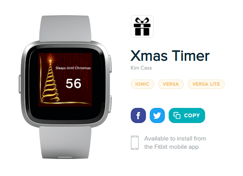
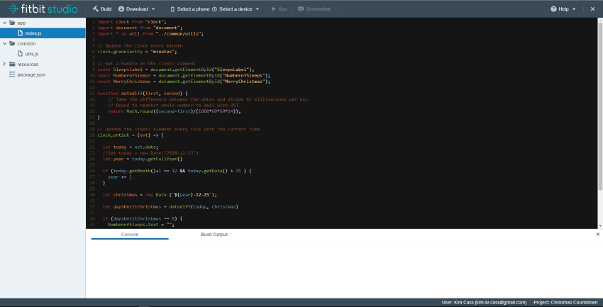
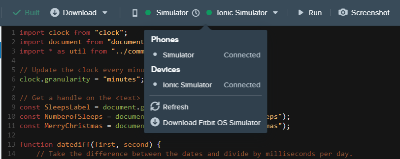
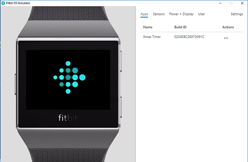
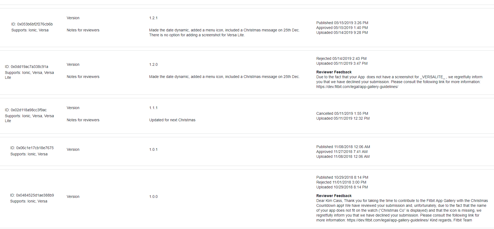

After purchasing my first Fitbit watch last year, I decided to take a crack at making a little app for it. I settled on the idea of the 'Countdown to Christmas' app, partially because of my odd obsession with that particular date,and partly because it seemed like a simple yet effective way of putting my own mark on the Fitbit App Gallery. While not as prevalent as the infamous Apple app store, it is also not as saturated, and therefore fresher ground for new developers such as myself.

The name was a problem. I originally wanted 'Christmas Countdown', but with the unreasonable character limit of 11 for app names I had to rethink. 'Xmas' doesn't sound all that formal, but it is character limit friendly.

Overall, I was impressed with their IDE (Integrated Developer Environment). Not being a seasoned developer myself, I found it very newbie friendly. Working from the browser, it allows you to write and organise your code similar to any text editor you can download. 

Once you have some code that you would like to try out, there is an ingenious little button that will allow you either to run your code right on your watch, or - perhaps more conveniently if you're going for a 'trial and error' approach - you can make use of the Fitbit simulator, which will run your code on a little simulated watch right on your screen. 

The simulator is a downloadable program that will show you what the app/screen will look like on your real device. It makes the 'Run, Mistake, Fix' process an awful lot quicker if you are not required to connect to your watch via Bluetooth each time. It comes especially handy when you are freehand trying to find the placement of text.

So, we have a satisfactory program with which to write our code. Here come the complaints, for it was not an especially smooth process completing the project and having it appear on the app store. 

There is no streamlined way with which to move the project from the editor to the submission page; in order to upload your app to the gallery submissions, you had to download a zipfile, and reupload it to a separate location. Not the end of the world but certainly a pain once there became multiple versions of the app. It became imperative keeping the different versions organised. And then we come to the submissions page. 

Three days to answer submission requests is reasonable, but my patience wears a little thin when being replied to by a robot. In between my first and third attempts at pushing is app, they brought out the 'Fitbit Lite', but forgot to add any way of including it in the dev screen, to the screenshots corresponding to the particular hardware became a problem. If you're going to bring out a new watch, please update the developer page to accommodate said equipment!

And with that we are finished. One bonified Christmas app! 

In conclusion, this was a fairly streamlined process, that I don't have too many criticisms for. However i do have a couple of concerned. For one thing,  there is no a push method like through git, so there is no reloading to a previous state if you find you have irrevocably messed up your code. I found myself copying and pasting lines of code that I knew worked, so I wouldn't have to go through the effort of trying to remember how I had previously written it. I think most devs will have recognised the importance of this not too far into their coding journeys. 

My second, and biggest, issue I have is that after you go to all that effort to write, submit, resubmit, submit again, talk to a robot, and eventually get the app onto the app store you do not find yourself with a separate page where people can rate and comment on your finished product. I think the motivation for a lot of developers is to see both the download count, and the (hopefully positive) feedback from your thousands of adoring downloadees. This is the downfall of the Fitbit developer experience; the only way I even knew that people were using my app was because I recieved numerous emails from Fitbit owners when the original iteration was not working. (I had failed to update the year, after Christmas 2018 had passed). Had everything worked perfectly, I would have had no feedback what so ever, and this isn't good motivation for flawless app creations.

But overall, I enjoyed the experience of making this little app, and as my skills improve, I hope that my apps will, too.
